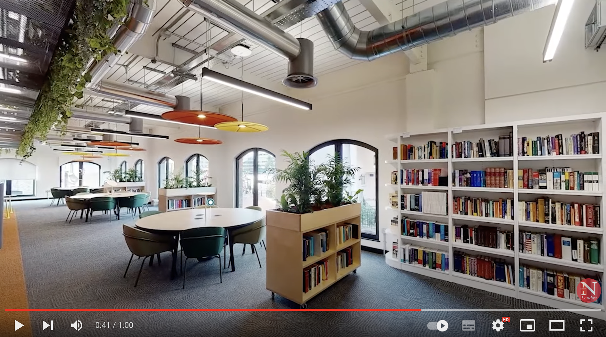

Do you want to come to London?

<!--more-->

**PhD opening in Network Science**!

There's a **fully Funded PhD Scholarship** in Network Science for UK or international students.
Come and join me at the [newly launched hub](https://www.networkscienceinstitute.org/hubs) of the [Network Science Institute](https://www.networkscienceinstitute.org/) at [Northeastern University London](https://www.nulondon.ac.uk/)!

**Subject areas**: Complex Systems, Network Science, Data Science, Computational Social Science, Animal Behaviour, Social Networks.

**Application deadline**: 1 April 2024\
**Expected starting date**: 1 October 2024

More info on how to apply, details of the position, requirements, etc. can be found [here](https://www.jobs.ac.uk/job/DGH718/northeastern-university-london-fully-funded-phd-scholarship-network-and-data-science-to-model-the-behaviour-of-complex-systems-of-human-and-non-human-social-animals).

Do not hesitate to **get in touch** for more info/general enquiries before the application deadline: iacopo.iacopini@nulondon.ac.uk

