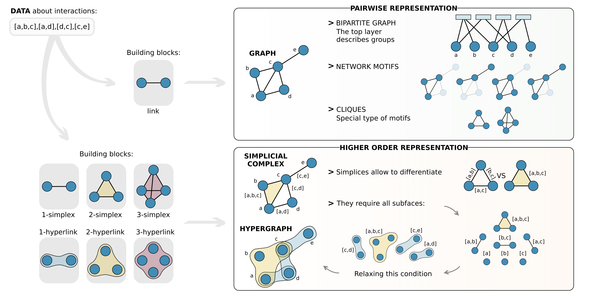
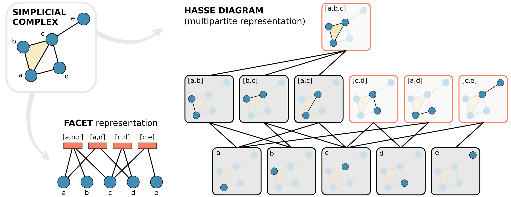
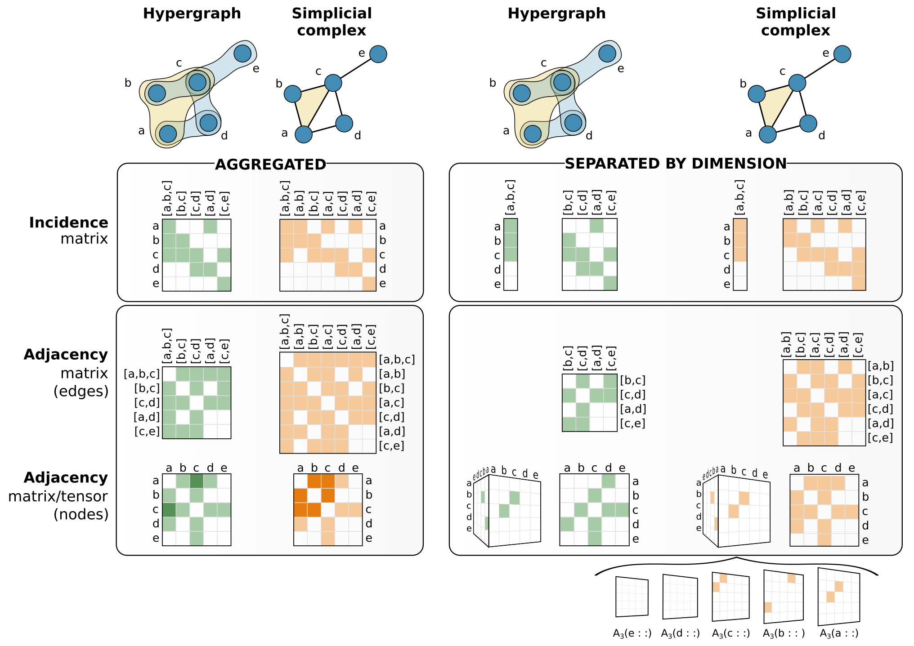
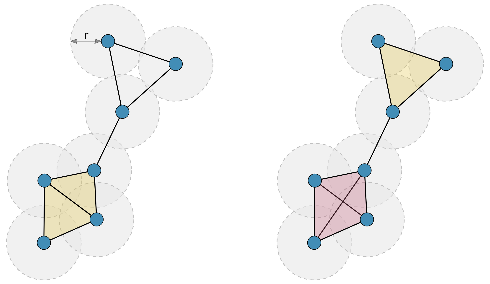
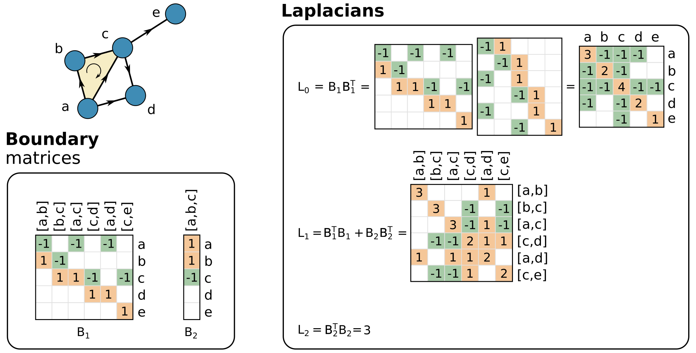
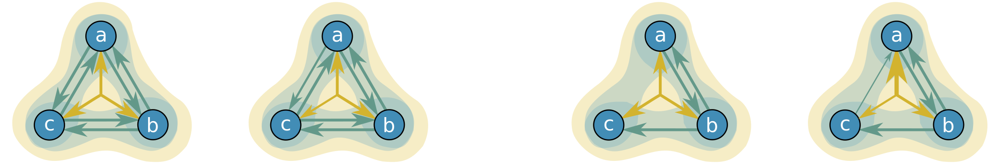
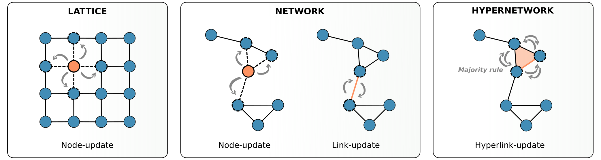
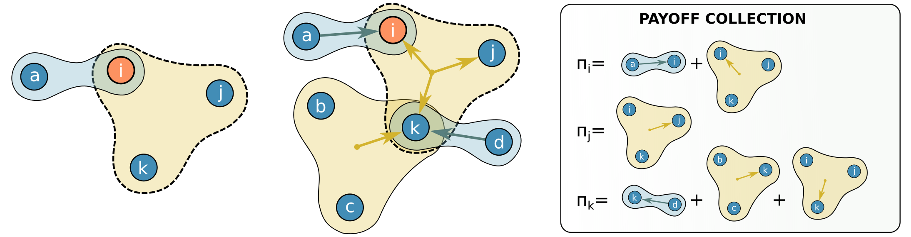
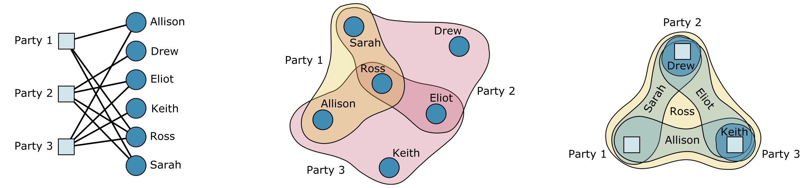

Everything you always wanted to know about higher-order interactions (but were afraid to ask)

<!--more-->

Our __review__ on the structure and dynamics of higher-order interactions is out in *Physics Reports*! ----> [[link to arXiv](https://doi.org/10.1016/j.physrep.2020.05.004)] - [[link to Physics Reports](https://doi.org/10.1016/j.physrep.2020.05.004)]

Any significant understanding of a complex system must rely on system level descriptions. After many years of reductionism, networks have emerged as a reference modeling tool for complex systems, triggering thousands of contributions over the last twenty years and leading to the formation of the new multidisciplinary field of *Network Science*. However, the fundamental limit of networks is that they capture pairwise interactions only, while many systems display group interactions. Indeed, in social systems, ecology and biology among other examples, many connections and relationships do not take place in pairs, but rather are collective actions at the level of groups.

[Here](https://arxiv.org/abs/2006.01764), together with [F. Battiston](http://www.personal.ceu.edu/staff/Federico_Battiston/), [G. Cencetti](https://scholar.google.com/citations?user=s8tIOXYAAAAJ&hl=en), [V. Latora](http://www.maths.qmul.ac.uk/~latora/), [M. Lucas](https://scholar.google.co.uk/citations?user=0Wr7HGIAAAAJ&hl=en), [A. Patania](https://alpatania.github.io/), [J.-G. Young](https://www.jgyoung.ca/) and [G. Petri](https://lordgrilo.github.io/), we give a complete overview of the emerging field of *networks beyond pairwise interactions* focusing on both structure and dynamics. 

We first discuss the methods to represent higher-order interactions and give a unified presentation of the different frameworks used to describe higher-order systems, highlighting the links between the existing concepts and representations.

We discuss the most common measures currently used to characterize and quantify the structural properties of systems with many-body interactions, at each level of their description.

For example, in the case of cliques, hyperedges, sets, or simplices, many common notions developed for ordinary graphs have been generalized to their higher-order counterparts. 

We also review the models proposed in the literature to generate synthetic structures, such as random and growing simplicial complexes, bipartite graphs and hypergraphs, and how they are used to make statical inferences.

In the second part of the review, we introduce and discuss the rapidly growing research on higher-order dynamical systems and on dynamical topology, with a particular focus on novel emergent phenomena characterizing landmark dynamical processes.

We start from models of higher-order diffusion and continuous-time random walks on simplicial complexes and hypergraphs.

We also discuss how coupled dynamical systems can be extended to higher-order structures, and how the presence of high-order interactions can affect synchronization in both phase oscillators and nonlinear dynamical systems.

We review a broad variety of models of social dynamics that account for non-pairwise social interactions, going from spreading processes and social contagions to models of opinions formation and consensus.

We then move to evolutionary games, often studied in a simple dyadic setting, but recently extended to investigate competition and cooperation among multiple agents.

Finally, we give an overview of real-world applications to systems with higher-order interactions such as social systems, neuroscience and brain networks, ecology and other biological systems. 

We conclude with an outlook on current modeling and conceptual frontiers.
