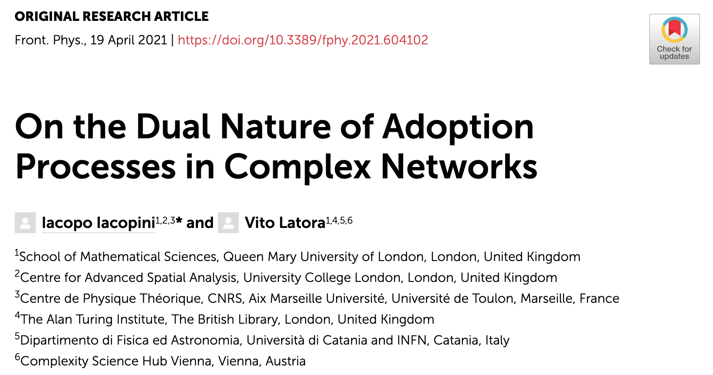

New perspective article on the dual nature of adoption processes

<!--more-->

Our new mini-review/perspective paper, written with [V. Latora](http://www.maths.qmul.ac.uk/~latora/), just got published in **Frontiers in Physics**: 

:point_right::point_right::point_right:[**"On the dual nature of adoption processes in complex networks"**](https://www.frontiersin.org/articles/10.3389/fphy.2021.604102/full) :point_left::point_left::point_left:

Adoption processes in socio-technological systems have been widely studied both empirically and theoretically. In this paper, we focus on network approaches that aim at capturing and modeling the fundamental mechanisms behind the social dynamics of __adoption__. The processes through which humans discover and adopt novel items–where by items we indicate not only artefacts or new technological or commercial products, but also concepts, ideas, social norms and behaviors–can be described in two radically different ways, both involving the presence of a complex network, whose nature is different in the two cases. 

Indeed, on one hand item adoption can be seen as a __contagion dynamics__ over a social network of individuals influencing each others through their social connections. On the other hand it can be described as an __exploration dynamics__ over a network of similarities among the different possible items that an individual can adopt.

{{< figure src="Fig1.png" title="Illustration of a contagion process. The adoption of norms, behaviors, ideas, technological items, etc., is typically modeled as a spreading process over a network of social contacts. Red and blue nodes of the social network denote respectively the adopters (or infected individuals) and the non-adopters (or susceptible) of the item that is spreading. For example, in (A) a smoker transmits the—bad—habit to its neighboring agents, which in turn can transmit it again through their social links (B)." width=600 >}}

In the first case a single item (a single product, idea, or behavior) is considered at once, and the transmission from one individual to another over a social system is modeled as an [epidemic-like spreading process](https://www.nature.com/articles/204225a0) across the links of a social network. Hence, the focus here is on the complex (and sometimes [higher-order](https://www.nature.com/articles/s41467-019-10431-6))structure of the underlying social network. 

{{< figure src="Fig2.png" title="Illustration of an exploration process.The cognitive process through which an individual agent explores the space of possibilities in search of novel items (novel ideas, technological discoveries) is usually modeled as a walk over a network of relations similarities or proximity) among items. For example, in (A) the agent discovers item $\beta$ and then continues the exploration over the links of the network by sequentially moving to node $\gamma$ and then to node $\delta$. In (B) three items have been discovered, and the exploratory walk can be seen as a sequence of symbols representing the visited nodes." width=600 >}}

In the second case, the main focus is instead on the network of existing relations between different items. Hence, the modeling attention is shifted towards the [cognitive processes](https://www.sciencedirect.com/science/article/pii/S235215462030142X) through which single individuals [explore the space of different possibilities](https://journals.aps.org/prl/abstract/10.1103/PhysRevLett.120.048301) and produce sequences of explored items in search of [novelties](https://www.nature.com/articles/srep05890). In this latter way of interpreting adoption dynamics, different exploration (and innovation) models have been proposed to replicate the (sometimes [multi-agent](https://journals.aps.org/prl/abstract/10.1103/PhysRevLett.125.248301)) processes of exploration according to which one idea, concept or item leads to another, and a discovery can trigger further ones.

[Here](https://www.frontiersin.org/articles/10.3389/fphy.2021.604102/full), we provide a brief overview of the existing models of social spreading and exploration and of the latest advancements in both directions. We propose to look at them as two complementary aspects of the same adoption process: on one hand there are items spreading over a social network of individuals influencing each others, on the other hand individuals explore a network of similarities among items to adopt. The two-fold nature of the approach proposed opens up new stimulating challenges for the scientific community of network and data scientists. We conclude by outlining some possible directions that we believe may be relevant to explore in the coming years.
