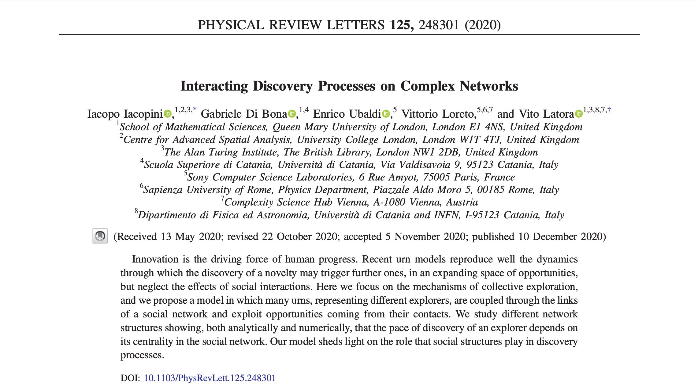

Expanding the adjacent possible to the social space

<!--more-->

Our paper **"Interactive discovery processes on complex networks"** with [G. Di Bona](https://www.qmul.ac.uk/maths/profiles/dibonag.html), [E. Ubaldi](https://csl.sony.fr/team/dr-enrico-ubaldi/), [V. Loreto](http://socialdynamics.it/vittorioloreto/) and [V. Latora](http://www.maths.qmul.ac.uk/~latora/) just got published in **Physical Review Letters**.

:point_right::point_right::point_right::point_right::point_right:[Have a look!](https://doi.org/10.1103/PhysRevLett.125.248301) :point_left::point_left::point_left::point_left::point_left:

We also made it to the [cover page](https://journals.aps.org/prl/issues/125/24)!


 

## **Short summary**

Discoveries are essential milestones for the progress of our societies. Recently, different mathematical approaches have been proposed to investigate and model the hidden mechanisms behind to the emergence of the new. Among these, of particular interest are random processes with reinforcement, such as urn models and biased random walks:
- F. Tria et al. [*"The dynamics of correlated novelties"*](https://www.nature.com/articles/srep05890)
- I. Iacopini et al. [*"Network Dynamics of Innovation Processes"*](https://journals.aps.org/prl/abstract/10.1103/PhysRevLett.120.048301)

These models could successfully replicate the basic signatures of real-world discovery and innovation processes, such as the Heaps’ law, a sub-linear growth of the number of distinct elements $D(t)\sim t^\beta$ with the number of elements $t$, which governs the rate at which novelties grow. However, they neglect the effects of social interactions. In particular, by considering the exploration dynamics as the one of a single entity and thus neglecting the multi-agent nature of the process, these models
- do not capture the **heterogeneity** of the pace of the individual explorers;
- do not include the benefits brought by **social interactions** and collaborations.

Indeed, empirical evidences of these mechanisms have been found in various contexts, from music-listening and language to politics and voting.  

{{< figure src="Fig1.png" title="Illustration of the model in the case of a network with two nodes. Each node is equipped with an urn obeying to the UMT with same parameters $\rho=2$ and $\nu=1$. At the time $t$, the urns start with two balls, one red (R) and the other blue (B). Then, each node extracts a ball (1:R, 2:B), and therefore $\rho$ additional balls of the same colors are added to the respective urns (reinforcement). Also, since in both cases, the extracted balls represent a novelty for the respective nodes, $\nu+1$ balls of new colors are also added (adjacent possible). At $t+1$, node $1$ has access to all its balls plus two extra ones coming from the adjacent possible in the social space, i.e., the set of balls available through its neighbor (dashed borders)." width=600 >}}

In this Letter, we propose a model of interacting discovery processes in which each explorer is associated with a node of a complex network, and an [urn model with triggering](https://www.nature.com/articles/srep05890) (UMT) governs its dynamics. In this framework, the appearance of a novelty opens up the possibility of further discoveries through an expansion into the [adjacent possible](https://www.ted.com/talks/vittorio_loreto_need_a_new_idea_start_at_the_edge_of_what_is_known). Urns are then coupled through the links of a network so that each exploration process is also subjected to interactions with the processes of the neighboring nodes, and explorers can exploit opportunities (possible discoveries) coming from their social contacts.



Social networks have been vastly used as structures on top of which dynamical processes take place. Here, we investigate the behavior of many coupled dynamical discovery processes on complex networks and study the impact of the network topology on the exploration dynamics. We find that the pace of discovery $\beta_i$ of an explorer strongly depends on its position in the social network. We obviously could not desist from using the [Zachary karate club](https://en.wikipedia.org/wiki/Zachary%27s_karate_club)  network. Notice the higher pace of discovery displayed by the notoriously central nodes. This proves that nodes with **identical UMTs** can have completely different dynamics, suggesting that a strategic location on the social network correlates with the discovery potential of an individual.

{{< figure src="Fig3.png" title="Heaps' dynamics of the interacting urns on five directed toy graphs (different symbols correspond to different nodes). Each node is equipped with a UMT with same parameters. (a-e) Temporal evolution of the number of discoveries $D_i(t)$ for each node $i$ (associated Heaps' exponents $\beta_{i}$ in the legend). The analytical solutions, shown as continuous black lines, are in perfect agreement with simulations. (f-j) Temporal behavior of the associated Heaps' exponents extracted at different times. The grey area up to $T=10^4$ corresponds to the values of (a-e)." width=400 >}}

We investigate this relation through numerical simulations on synthetic and real-world networks, and we identify the key role played by the network centrality. While thermalization times---typical of empirical trajectories of diffusion process---are strongly influenced by the topology of the network, we find **the ranking induced by the pace of discovery persists at all finite times**.

{{< figure src="Fig4.png" title="Scatter plot and Spearman's rank correlation coefficients $r_{S}$ between fitted Heaps' exponents $\beta_i$ and normalized $\alpha$-centrality $c^{[\alpha]}_i/c^{[\alpha]}_{\text{max}}$ associated to the $i=1,\dots,N$ nodes of four empirical networks: (a) the Zachary Karate Club, (b) a Twitter network of followers, (c) a co-authorship network in network science and (d) a collaboration network between jazz musicians." width=500 >}}

We further explore this characteristic behavior and ultimately prove its **universality for all networks**. In particular, we show that the ranking of the nodes that distinguishes the fastest explorers can be predicted **analytically** by using the eigenvector centrality (or the $\alpha$-centrality in the most general case of non-strongly connected graphs). This highlights that the structural---not just local---properties of the nodes can strongly affect their ability to discover novelties.

